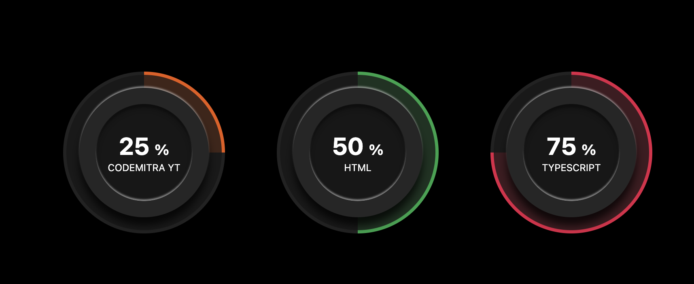
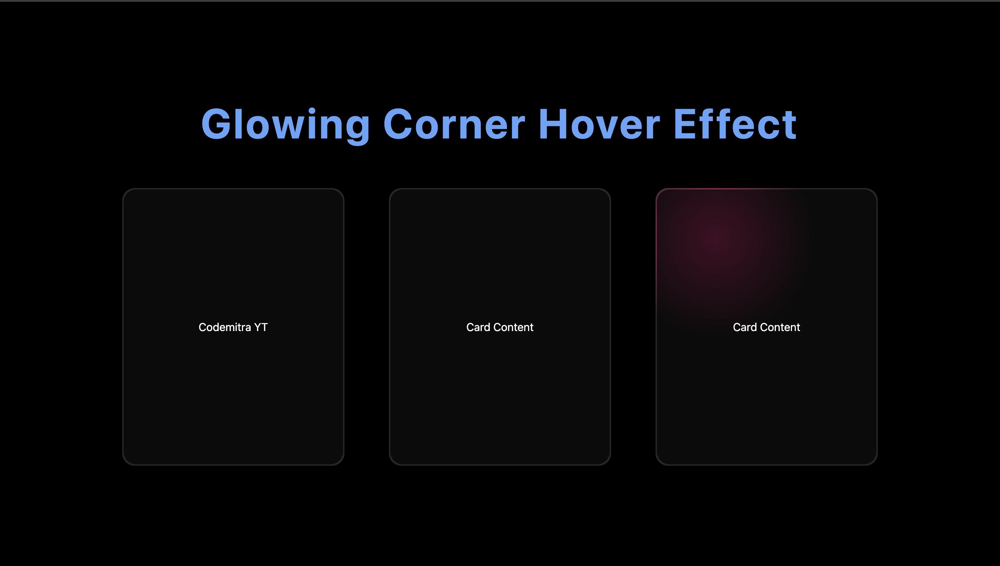
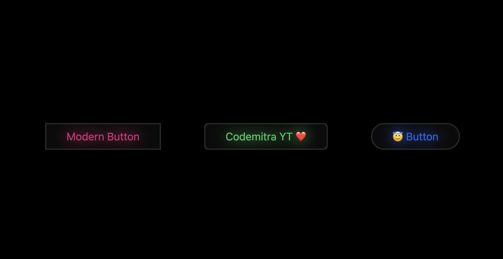

<div align="center"> 


<h1> Codemitra YT : Tailwind Component </h1>
</div>

### Circular Progress Bar

  

- [Component Code](https://github.com/codemitrayt/codemitrayt-tw-design/blob/main/src/components/circular-progress-bar)

```js
const App = () => {
  return (
    <CircularProgressBar
      title="@codemitrayt"
      color="#16a34a"
      percentage={50}
      className="some tw classes"
    />
  );
};
```

### Glowing Corner Hover Effect

  

- [Component Code](https://github.com/codemitrayt/codemitrayt-tw-design/blob/main/src/components/glowing-corner-hover-effect)

```js
const App = () => {
  return (
    <GlowingCornerHoverEffects color="#22c55e">
      <div>Codemitra YT</div>
    </GlowingCornerHoverEffects>
  );
};
```

### Glowing Hover Buttons

  

- [Component Code](https://github.com/codemitrayt/codemitrayt-tw-design/blob/main/src/components/glowing-hover-button)

```js
const App = () => {
  return (
     <GlowingHoverButton
        color="#22c55e"
        title="Codemitra YT ❤️"
        className="rounded-md after:rounded-md"
      />
  );
};
```